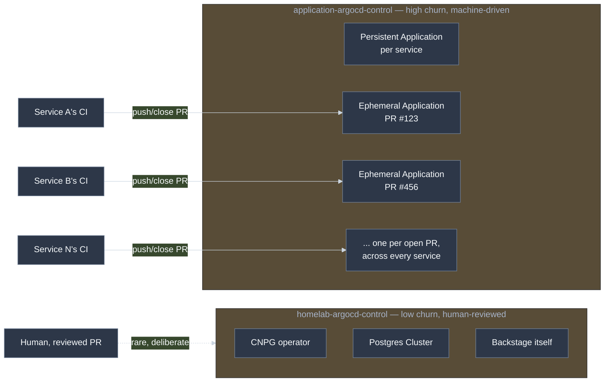

# Two Argo CD Control Repos: Core Platform vs. Application-Level

## Status
Accepted

## Context

This cluster has two separate Argo CD app-of-apps control repos:
[`homelab-argocd-control`](https://github.com/lukasb27/homelab-argocd-control)
(this repo) and
[`application-argocd-control`](https://github.com/lukasb27/application-argocd-control).
The obvious question — asked directly during a documentation review on
2026-08-15 — is why not just one. Worth answering precisely rather than
leaving it as an assumption, since the two repos have genuinely different
content:

- **This repo** holds long-lived, human-reviewed, low-churn platform
  infrastructure: the CNPG operator
  ([`apps/cloudnative-pg.yaml`](https://github.com/lukasb27/homelab-argocd-control/blob/main/apps/cloudnative-pg.yaml)),
  the Postgres `Cluster` backing Backstage's own database
  ([`apps/backstage-db-cluster.yaml`](https://github.com/lukasb27/homelab-argocd-control/blob/main/apps/backstage-db-cluster.yaml)),
  and Backstage itself
  ([`apps/backstage.yaml`](https://github.com/lukasb27/homelab-argocd-control/blob/main/apps/backstage.yaml)).
  Changes here happen rarely, deliberately, and are always reviewed by a
  human before merge.
- **`application-argocd-control`** holds one persistent Argo CD `Application`
  per service scaffolded from the golden-path template, plus one *ephemeral*
  `Application` per open PR across every one of those services — created and
  destroyed automatically, constantly, by each service's own CI, with no
  human review in the loop for routine churn.

Both repos are watched by their own root `Application` (`main.yaml` in each,
applied once via `kubectl apply` — see each repo's own README for the
bootstrap step), both with `automated: { prune: true, selfHeal: true }`.

## Decision

Keep them separate. The distinction is about **churn rate and blast radius**,
not repo-count aesthetics:

If these were one repo, that repo's Argo CD-watched tree — with `prune: true`
enabled, deliberately, so closed-PR environments actually get torn down —
would hold both "delete this throwaway PR environment automatically" and
"the actual production Postgres cluster backing the whole Backstage
instance." A bug in one service's cleanup automation, or a CI job gone
wrong producing a malformed manifest, would then have a plausible (if
unlikely) path to affecting core platform infrastructure, purely because
they'd share the same watched directory and the same blanket prune policy.
Separating high-churn/automated changes from low-churn/deliberate ones is a
standard pattern in real GitOps setups for exactly this reason.

Merging them was explicitly considered, not just left unexamined:

- **For merging:** fewer repos, simpler mental model for a single-operator
  homelab; one bootstrap step instead of two.
- **Against merging:** the blast-radius argument above; different git
  history/PR-review audiences (a human wants to read platform infra diffs
  carefully — nobody reads or should need to read hundreds of automated
  per-PR ephemeral-environment diffs); `prune: true` feels — and is — safer
  to lean on aggressively when the only things it can prune are disposable,
  by design.

The against-merging case won.

## Consequences

**Positive:** a bug or runaway CI job in any single service's ephemeral-
environment automation is contained to `application-argocd-control` — it has
no plausible path to affecting the CNPG operator, the Postgres cluster, or
Backstage itself, because those simply aren't in the same watched tree.

**Negative / debt:** two bootstrap steps instead of one, two READMEs to keep
in sync, and a real cost already paid once: `application-argocd-control`
(né `fermentation-station-argocd-control`, né `lukas-argocd-control`) spent
time with a name that didn't describe its actual scope, because reusing an
already-bootstrapped repo was cheaper than standing up a second one from
scratch at the time. That's a one-time naming-debt cost of the split, not a
recurring one, but real.

## Revisit Trigger

Revisit if the operational overhead of two repos (two bootstrap steps, two
things to keep documented) ever outweighs the isolation benefit — most
likely if this ever moves beyond a single-operator homelab to a setting
where the blast-radius argument matters less than operational simplicity, or
conversely, revisit *harder* in the other direction (even more isolation,
e.g. per-team or per-environment repos) if the number of services sharing
`application-argocd-control` grows large enough that its own churn becomes
hard to reason about.
